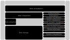

# Building blocks

Services are delivered through a set of reusable digital building blocks.

These building blocks represent modular capabilities that can be implemented independently while working together as an integrated whole. They enable flexibility in implementation while ensuring interoperability across countries and systems.

The architecture establishes separate regional registries for clients, healthcare providers, and healthcare facilities. Each registry maintains a regional unique identifier for its respective entity:

- RUCID — Regional Unique Client Identifier
- RUPID — Regional Unique Provider Identifier
- RUFID — Regional Unique Facility Identifier

## Data consumption

| Attribute | Content |
|----------|----------|
| Purpose | Enables healthcare professionals, systems, and patients to securely retrieve and use health information from local or cross-border sources. |
| Service | Cross-border healthcare service |
| Key information | - |
| Furfilled by | Healthcare providers, clients, EHRs, LIMSs, RISs, PACSs, public health systems, integration platforms |
| Regional constraints | List |
| Upstream dependencies | List of building blocks |
| Downstream dependencies | List of building blocks |
| Interoperability requirements | HL7 FHIR, CDA, DICOM, IHE profiles, SNOMED CT, LOINC |

## Data distribution

| Attribute | Content |
|----------|----------|
| Purpose | Facilitates secure distribution of healthcare information to organisations, regions, and countries. |
| Service | Cross-border data distribution service  |
| Key information | Clinical record, lab result, radiology information, medical image, public health data |
| Furfilled by | EHRs, LIMSs, RISs, PACSs, public health systems, integration platforms |
| Regional constraints | List |
| Upstream dependencies | List of building blocks |
| Downstream dependencies | List of building blocks |
| Interoperability requirements | HL7 FHIR, CDA, DICOM, IHE profiles, SNOMED CT, LOINC |

## Data integration & adapter

| Attribute | Content |
|----------|----------|
| Purpose | Translates, transforms, enriches, and orchestrates healthcare data between heterogeneous systems and standards. |
| Service | Data integration service |
| Key information | Message transformations, mappings, orchestration rules, canonical models |
| Furfilled by | Integration platforms |
| Regional constraints | List |
| Upstream dependencies | List of building blocks |
| Downstream dependencies | List of building blocks |
| Interoperability requirements | HL7 FHIR, CDA, DICOM, IHE profiles, SNOMED CT, LOINC |

## Authentication

| Attribute | Content |
|----------|----------|
| Purpose | Verifies the identity of users, systems, and organisations accessing healthcare services. |
| Service | Shared healthcare service (authentication) |
| Key information | Credential Artifact, Trust Anchor |
| Furfilled by | Identity provider, Token service, MFA Engine |
| Regional constraints | List |
| Upstream dependencies | List of building blocks |
| Downstream dependencies | List of building blocks |
| Interoperability requirements | OAuth2, OpenID Connect, SAML2, X.509, FIDO2/WebAuthn |

## Autorisation

| Attribute | Content |
|----------|----------|
| Purpose | Determines whether authenticated users or systems are permitted to access specific healthcare data or services according to policy and consent. |
| Service | Shared healthcare service (autorisation) |
| Key information | Audit log |
| Furfilled by | Log aggregator, Log enrichment engine, Audit store, Altering engine (SIEM/SOAR) |
| Regional constraints | List |
| Upstream dependencies | List of building blocks |
| Downstream dependencies | List of building blocks |
| Interoperability requirements | Terminology, sematics, API's |

## Audit tracing

| Attribute | Content |
|----------|----------|
| Purpose | Records and monitors healthcare data access and system activity for compliance, security, and forensic analysis. |
| Service | Shared healthcare service (audit tracing) |
| Regional constraints | List |
| Key information | List of main entities |
| Cross-border considerations | ? |
| Upstream dependencies | List of building blocks |
| Downstream dependencies | List of building blocks |
| Interoperability requirements | IHE ATNA, syslog, OpenTelemetry, FHIR AuditEvent |

## Consent registration

| Attribute | Content |
|----------|----------|
| Purpose | Manages patient consent preferences for data sharing, processing, and cross-border access. |
| Service | Shared healthcare service (consent registration) |
| Key information | Data sharing consent |
| Furfilled by | Log aggregator, Log enrichment engine, Audit store, Altering engine (SIEM/SOAR) |
| Regional constraints | List |
| Upstream dependencies | List of building blocks |
| Downstream dependencies | List of building blocks |
| Interoperability requirements | Terminology, sematics, API's |

## Client registration

| Attribute | Content |
|----------|----------|
| Purpose | Maintains unique identification and demographic information for patients and citizens participating in healthcare services. |
| Service | Shared healthcare service (client registration) |
| Key information | Client |
| Furfilled by | - |
| Regional constraints | List |
| Upstream dependencies | List of building blocks |
| Downstream dependencies | List of building blocks |
| Interoperability requirements | Terminology, sematics, API's |

## Healthcare provider registration

| Attribute | Content |
|----------|----------|
| Purpose | Maintains trusted information about healthcare professionals and their credentials, affiliations, and permissions. |
| Service | Shared healthcare service (healthcare provider registration) |
| Key information | provider |
| Furfilled by | - |
| Regional constraints | List |
| Upstream dependencies | List of building blocks |
| Downstream dependencies | List of building blocks |
| Interoperability requirements | Terminology, sematics, API's |

## Facility registration

| Attribute | Content |
|----------|----------|
| Purpose | Maintains trusted information about healthcare organisations, facilities, laboratories, and care locations. |
| Service | Shared healthcare service (facility registration) |
| Key information | facility |
| Furfilled by | - |
| Regional constraints | List |
| Upstream dependencies | List of building blocks |
| Downstream dependencies | List of building blocks |
| Interoperability requirements | Terminology, sematics, API's |

## Product catalogue

| Attribute | Content |
|----------|----------|
| Purpose | Provides standardised reference information for medicines, medical devices, and healthcare products used across healthcare services. |
| Service | Shared healthcare service (product catalogue) |
| Key information | medicine, medical device |
| Furfilled by | - |
| Regional constraints | List |
| Upstream dependencies | List of building blocks |
| Downstream dependencies | List of building blocks |
| Interoperability requirements | Terminology, sematics, API's |

## ...

